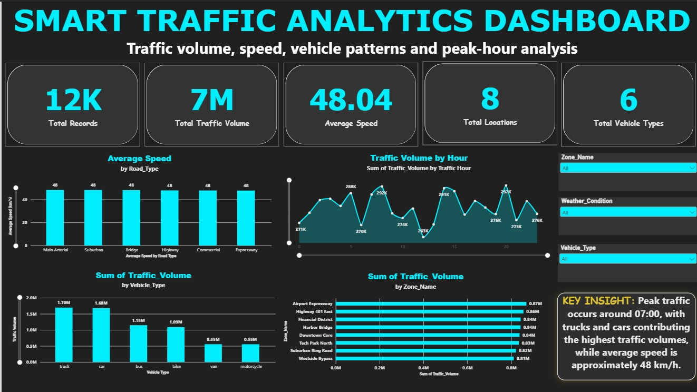

# Smart Traffic Data Engineering & Analytics Pipeline

A data engineering and analytics project built to take raw traffic data through a complete data pipeline, from cleaning and validation to SQL analysis and interactive Power BI reporting.

The project uses Python and Pandas for ETL, MySQL for structured storage and analysis, and Power BI for visualization.

## Project Overview

The dataset contains traffic records collected from different locations, including information about vehicle types, speed, traffic volume, weather conditions, lanes, and location details.

The main goal of this project was to build a complete workflow where raw and inconsistent data is transformed into clean, structured data that can be analyzed and visualized.

The project follows this flow:

Raw Excel Data
        ↓
Python / Pandas ETL
        ↓
Cleaned and Validated Data
        ↓
MySQL Database
        ↓
SQL Analysis and Views
        ↓
Power BI Dashboard

## Dataset

The original dataset is stored in:

`smart_traffic_dataset-v2.xlsx`

The raw dataset contains approximately 12,000 traffic records.

### Traffic data includes

- Record ID
- Timestamp
- Location ID
- Vehicle Type
- Speed (km/h)
- Traffic Volume
- Weather Condition
- Lane Number

### Location lookup includes

- Location ID
- Zone Name
- Road Type
- Speed Limit (km/h)

The raw data intentionally contains issues such as missing values, inconsistent text casing, and other data quality problems. These issues are handled during the ETL process.

## ETL Process

Python and Pandas are used to prepare the raw data before loading it into MySQL.

The main ETL steps include:

### 1. Extract

The raw Excel workbook is loaded into Pandas using separate DataFrames for traffic logs and location information.

### 2. Clean

The data is cleaned by:

- Standardizing text formatting
- Removing unnecessary whitespace
- Standardizing vehicle and weather categories
- Converting timestamps to the correct datetime format
- Standardizing Location IDs
- Handling missing values
- Checking for duplicate records
- Checking for invalid values
- Validating relationships between traffic records and locations

### 3. Transform

The cleaned traffic data is combined with the location lookup data.

This adds information such as:

- Zone
- Road type
- Speed limit

to the traffic records.

### 4. Validate

Several checks are performed before loading the data into the database, including:

- Missing value checks
- Duplicate checks
- Data type validation
- Location ID consistency
- Range checks
- Record count validation

### 5. Load

The cleaned data is exported to CSV files and loaded into MySQL.

## MySQL Database

The project uses MySQL as the main relational database.

The database contains two primary tables:

### `locations`

Stores location-related information.

Key fields include:

- Location_ID
- Zone_Name
- Road_Type
- Speed_Limit_kmh

### `traffic_logs`

Stores the cleaned traffic records.

Key fields include:

- Record_ID
- Timestamp
- Location_ID
- Vehicle_Type
- Speed_kmh
- Traffic_Volume
- Weather_Condition
- Lane_Number

`Location_ID` is used to connect the traffic records with the location table.

## SQL Analysis

SQL was used to analyze the cleaned traffic data and answer different analytical questions.

The project uses:

- SELECT statements
- Filtering
- GROUP BY
- HAVING
- ORDER BY
- JOINs
- Subqueries
- Common Table Expressions (CTEs)
- Aggregate functions
- Window functions
- Ranking functions
- Views

Some of the analysis includes:

- Total traffic volume
- Average vehicle speed
- Traffic by location
- Traffic by zone
- Traffic by vehicle type
- Traffic by weather condition
- Traffic by road type
- Peak traffic hours
- Average speed compared with speed limits
- Vehicle speed comparisons
- Location rankings
- Vehicle rankings
- Hourly traffic trends

Several SQL views were also created to provide structured datasets for reporting and Power BI.

## Power BI Dashboard

The final analysis is presented through an interactive Power BI dashboard.
## Power BI Dashboard

The final analysis is presented through an interactive Power BI dashboard.



The dashboard includes KPIs for:

- Total Records
- Total Traffic Volume
- Average Speed
- Total Locations
- Total Vehicle Types

It also contains visualizations for:

- Traffic Volume by Hour
- Traffic Volume by Vehicle Type
- Traffic Volume by Zone
- Average Speed by Road Type

Interactive slicers allow the dashboard to be filtered by:

- Zone
- Vehicle Type
- Weather Condition

The dashboard is designed to provide a quick overview of traffic patterns while still allowing users to explore the data interactively.

## Key Insights

The analysis allows traffic patterns to be viewed from different perspectives.

Some of the main observations include:

- Traffic volume changes significantly across different hours of the day.
- Cars and trucks account for a large share of the overall traffic volume.
- Traffic volume varies between different zones and locations.
- Average speed remains around 48 km/h across the overall dataset.
- Road type and weather conditions can be used to investigate differences in traffic and speed patterns.

These insights are based on the cleaned dataset and the analysis performed in MySQL and Power BI.

## Project Structure

```text
Smart Traffic Data Engineering & Analytics Pipeline/
│
├── smart_traffic_dataset-v2.xlsx
├── etl_pipeline.ipynb
├── locations.csv
├── traffic_logs.csv
├── Database_File.sql
└── smart_traffic_analysis.pbix
